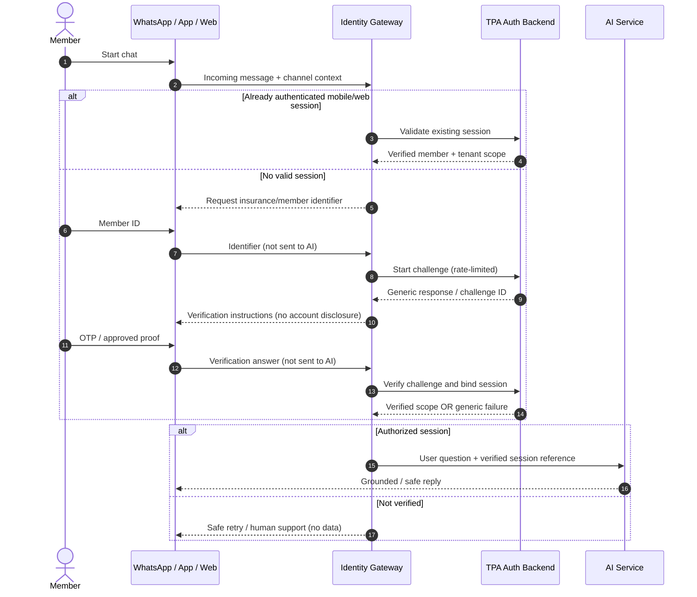

# Diagram 02 — Member verification sequence

```mermaid
sequenceDiagram
    autonumber
    actor Member
    participant Channel as WhatsApp / App / Web
    participant Gate as Identity Gateway
    participant Auth as TPA Auth Backend
    participant AI as AI Service
    Member->>Channel: Start chat
    Channel->>Gate: Incoming message + channel context
    alt Already authenticated mobile/web session
        Gate->>Auth: Validate existing session
        Auth-->>Gate: Verified member + tenant scope
    else No valid session
        Gate-->>Channel: Request insurance/member identifier
        Member->>Channel: Member ID
        Channel->>Gate: Identifier (not sent to AI)
        Gate->>Auth: Start challenge (rate-limited)
        Auth-->>Gate: Generic response / challenge ID
        Gate-->>Channel: Verification instructions (no account disclosure)
        Member->>Channel: OTP / approved proof
        Channel->>Gate: Verification answer (not sent to AI)
        Gate->>Auth: Verify challenge and bind session
        Auth-->>Gate: Verified scope OR generic failure
    end
    alt Authorized session
        Gate->>AI: User question + verified session reference
        AI-->>Channel: Grounded / safe reply
    else Not verified
        Gate-->>Channel: Safe retry / human support (no data)
    end
```

**Note:** OTP and channel session mechanics are proposed, not implemented. OTP is never a model message.
