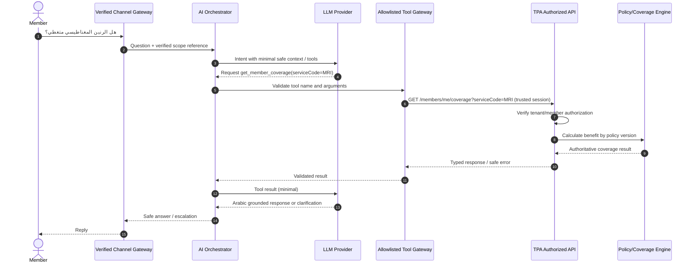

# Diagram 03 — Coverage inquiry sequence

```mermaid
sequenceDiagram
    autonumber
    actor Member
    participant Gate as Verified Channel Gateway
    participant AI as AI Orchestrator
    participant Model as LLM Provider
    participant Tool as Allowlisted Tool Gateway
    participant Backend as TPA Authorized API
    participant Engine as Policy/Coverage Engine
    Member->>Gate: هل الرنين المغناطيسي متغطي؟
    Gate->>AI: Question + verified scope reference
    AI->>Model: Intent with minimal safe context / tools
    Model-->>AI: Request get_member_coverage(serviceCode=MRI)
    AI->>Tool: Validate tool name and arguments
    Tool->>Backend: GET /members/me/coverage?serviceCode=MRI (trusted session)
    Backend->>Backend: Verify tenant/member authorization
    Backend->>Engine: Calculate benefit by policy version
    Engine-->>Backend: Authoritative coverage result
    Backend-->>Tool: Typed response / safe error
    Tool-->>AI: Validated result
    AI->>Model: Tool result (minimal)
    Model-->>AI: Arabic grounded response or clarification
    AI-->>Gate: Safe answer / escalation
    Gate-->>Member: Reply
```

If not verified, **do not start this sequence**. The coverage engine, not the LLM, computes benefit limits and approval requirements.
